# Modeling Clinical Reasoning from Multimodal Interaction Signals

<p align="center">
  <strong>Unsupervised Discovery of Radiological Reading Strategies<br/>via Gaze–Speech Behavioral Representations</strong>
</p>

<p align="center">
  <a href="#abstract">Abstract</a> •
  <a href="#contributions">Contributions</a> •
  <a href="#related-work">Related Work</a> •
  <a href="#method">Method</a> •
  <a href="#data">Data</a> •
  <a href="#experimental-setup">Experimental Setup</a> •
  <a href="#results">Results</a> •
  <a href="#discussion">Discussion</a> •
  <a href="#limitations">Limitations</a> •
  <a href="#reproduction">Reproduction</a> •
  <a href="#citation">Citation</a>
</p>

---

## Abstract

Understanding how clinicians visually and verbally reason during medical image interpretation remains a fundamental challenge for building interpretable clinical AI. We present a computational framework for modeling clinician behavior during chest X-ray (CXR) interpretation by integrating three interaction modalities: eye-tracking scanpaths, spoken diagnostic reasoning, and cross-modal temporal alignment.

From a dataset of 50 simulated clinician interpretation sessions — each containing synchronized gaze recordings (~60 Hz) and time-stamped speech transcripts — we extract a **46-dimensional behavioral feature vector** comprising gaze dynamics (scanpath statistics, fixation distributions, saccadic velocity profiles, AOI dwell proportions), speech representations (Sentence-Transformer embeddings projected via PCA, augmented with interpretable linguistic markers), and cross-modal coordination metrics (gaze–speech temporal lag, fixation–utterance synchrony).

Unsupervised clustering over this representation identifies **three clinician reading strategies**: a *Mixed Strategy* characterized by systematic bilateral exploration and verbal hypothesis testing, a *Rapid Scanner* strategy driven by high-velocity visual search with minimal verbal elaboration, and a *Focused Inspector* strategy defined by prolonged fixations on limited anatomical regions. Feature ablation reveals that **gaze behavioral features alone yield the strongest cluster separation** (silhouette = 0.369), while full multimodal concatenation reduces separability (silhouette = 0.104), indicating that naïve early fusion dilutes discriminative gaze signals — a finding with direct implications for modality selection in behavioral modeling pipelines.

---

## Contributions

1. **Multimodal behavioral representation.** A 46-dimensional feature space combining gaze dynamics, speech embeddings, and cross-modal temporal features, providing a structured encoding of clinician interaction behavior during radiological interpretation.

2. **Unsupervised strategy discovery.** Identification of three interpretable clinician reading archetypes via clustering over behavioral representations, without any diagnostic labels or supervision.

3. **Gaze–speech coordination analysis.** Quantitative characterization of temporal coupling between visual attention and verbal reasoning across distinct diagnostic workflows.

4. **Systematic feature ablation.** Empirical evidence that gaze behavioral features carry the dominant discriminative signal, with analysis of how feature dimensionality and modality composition affect cluster quality — providing guidance for modality prioritization in clinical behavior modeling.

---

## Related Work

This work is situated at the intersection of medical image perception research, multimodal behavior analysis, and clinical AI interpretability.

**Radiological eye-tracking.** Foundational work by Kundel and Nodine (1983) established that expert radiologists exhibit distinct search-then-recognize gaze patterns during image interpretation. Subsequent studies (Drew et al., 2013; Brunyé et al., 2019) demonstrated that scanpath characteristics — fixation duration, revisit frequency, and saccadic amplitude — correlate with diagnostic expertise and error rates. Our framework builds on this tradition by constructing computational representations of these patterns for unsupervised analysis rather than manual classification.

**Multimodal clinical behavior analysis.** Prior work has studied gaze and speech independently in clinical settings: verbal protocol analysis (Azevedo, 2015) and eye-tracking studies of radiological search (Bertram et al., 2013). Recent efforts have begun combining modalities (Karargyris et al., 2021), but systematic frameworks for joint gaze–speech representation remain limited. Our approach addresses this gap by constructing a unified feature space with explicit cross-modal alignment metrics.

**Unsupervised behavior modeling.** Clustering of eye-tracking data has been applied in reading research (Behrens et al., 2023) and web interaction analysis (Buscher et al., 2009), but its application to medical image interpretation with multimodal features remains underexplored. Our work extends unsupervised behavioral clustering to the clinical domain using a richer feature space than prior gaze-only analyses.

---

## Method

### Notation

Let $\mathcal{S} = \{s_1, \ldots, s_N\}$ denote a set of $N = 50$ clinician interpretation sessions. Each session $s_i$ consists of a synchronized gaze recording $\mathbf{G}_i = \{(x_t, y_t, t)\}_{t=1}^{T_i}$ sampled at approximately 60 Hz and a speech transcript $\mathbf{U}_i = \{(u_j, t_j^{\text{start}}, t_j^{\text{end}})\}_{j=1}^{M_i}$ with $M_i$ utterance segments. The goal is to construct a behavioral feature vector $\mathbf{z}_i \in \mathbb{R}^{46}$ for each session and discover latent strategy clusters $\mathcal{C} = \{C_1, \ldots, C_k\}$ without supervision.

### Pipeline Architecture

```
┌───────────────────────────────────────────────────────────────────────┐
│  1. DATA INGESTION                                                    │
│     CXR Image  ·  Gaze Recording G_i  ·  Speech Transcript U_i       │
└─────────────────────────────┬─────────────────────────────────────────┘
                              │
                              ▼
┌───────────────────────────────────────────────────────────────────────┐
│  2. PREPROCESSING                                                     │
│     Fixation detection (I-VT, threshold = 50°/s)                      │
│     Utterance segmentation and tokenization                           │
│     AOI mapping (5 anatomical regions)                                │
└─────────────────────────────┬─────────────────────────────────────────┘
                              │
                              ▼
┌───────────────────────────────────────────────────────────────────────┐
│  3. MODALITY-SPECIFIC FEATURE EXTRACTION                              │
│                                                                       │
│  ┌─────────────────────┐ ┌─────────────────────┐ ┌────────────────┐  │
│  │ Gaze Features        │ │ Speech Features      │ │ Cross-Modal    │  │
│  │ (19 dims)            │ │ (14 dims)            │ │ (13 dims)      │  │
│  │                      │ │                      │ │                │  │
│  │ Behavioral (8):      │ │ Embedding (8):       │ │ Temporal lag   │  │
│  │  scanpath length     │ │  MiniLM-L6-v2 384-d  │ │  (mean, var)  │  │
│  │  fixation count      │ │  → PCA to 8-d        │ │ Fixation–utt.  │  │
│  │  mean/max fix. dur.  │ │  (92.3% var retained)│ │  synchrony     │  │
│  │  mean/var velocity   │ │                      │ │ AOI-conditioned│  │
│  │  revisit rate        │ │ Linguistic (6):      │ │  speech onset  │  │
│  │  saccade amplitude   │ │  anatomical mentions │ │ Coordination   │  │
│  │                      │ │  radiological findgs │ │  entropy       │  │
│  │ AOI Spatial (11):    │ │  negation markers    │ │                │  │
│  │  dwell proportion    │ │  uncertainty hedges  │ │                │  │
│  │  per region (×5)     │ │  report length       │ │                │  │
│  │  first-fixation AOI  │ │  lexical diversity   │ │                │  │
│  │  transition entropy  │ │                      │ │                │  │
│  │  AOI coverage ratio  │ │                      │ │                │  │
│  │  bilateral symmetry  │ │                      │ │                │  │
│  │  revisits per AOI (2)│ │                      │ │                │  │
│  └─────────────────────┘ └─────────────────────┘ └────────────────┘  │
└─────────────────────────────┬─────────────────────────────────────────┘
                              │
                              ▼
┌───────────────────────────────────────────────────────────────────────┐
│  4. REPRESENTATION CONSTRUCTION                                       │
│     z_i = [gaze_i ; speech_i ; crossmodal_i] ∈ R^46                  │
│     z-score standardization per feature                               │
└─────────────────────────────┬─────────────────────────────────────────┘
                              │
                              ▼
┌───────────────────────────────────────────────────────────────────────┐
│  5. UNSUPERVISED CLUSTERING & ANALYSIS                                │
│     KMeans (k ∈ {2,...,8}, selected k=3 by silhouette + elbow)        │
│     Dimensionality reduction: PCA (variance analysis), UMAP (viz)     │
│     Feature ablation over modality subsets                            │
└───────────────────────────────────────────────────────────────────────┘
```

### Preprocessing

**Fixation detection.** Raw gaze samples $(x_t, y_t)$ are classified into fixations and saccades using an Identification by Velocity Threshold (I-VT) algorithm with a velocity threshold of 50°/s and minimum fixation duration of 100 ms. Consecutive sub-threshold samples are aggregated into fixation events characterized by centroid coordinates, duration, and onset time.

**AOI mapping.** Five anatomical regions of interest are defined on the CXR: left lung field, right lung field, mediastinum, cardiac silhouette, and costophrenic angles. Regions are specified as axis-aligned bounding boxes over normalized CXR coordinates. Each fixation is assigned to the AOI containing its centroid; fixations outside all defined AOIs are labeled as peripheral.

**Utterance segmentation.** Speech transcripts are segmented into utterance-level units with associated onset and offset timestamps, enabling temporal alignment with the gaze stream.

### Gaze Feature Extraction (19 dimensions)

Gaze features are organized into two subgroups to enable targeted ablation analysis.

**Behavioral features (8 dims)** capture temporal dynamics of visual search independent of spatial AOI structure:

| Feature | Definition |
|---|---|
| `scanpath_length` | Total Euclidean path length: $L = \sum_{t=1}^{T-1} \lVert\mathbf{p}_{t+1} - \mathbf{p}_t\rVert_2$ where $\mathbf{p}_t = (x_t, y_t)$ |
| `fixation_count` | Total number of detected fixation events |
| `mean_fixation_duration` | $\bar{d} = \frac{1}{F}\sum_{f=1}^{F} d_f$ where $d_f$ is the duration (ms) of fixation $f$ |
| `max_fixation_duration` | $\max_f \, d_f$ across all fixations |
| `mean_velocity` | Mean saccadic velocity (°/s) computed over saccade segments only |
| `velocity_variance` | Variance of saccadic velocity distribution |
| `revisit_rate` | Proportion of fixations directed to a previously visited AOI |
| `mean_saccade_amplitude` | Mean angular distance (°) per saccade |

**AOI spatial features (11 dims)** encode the spatial distribution of attention across anatomical regions:

| Feature | Dims | Definition |
|---|---|---|
| `dwell_proportion` | 5 | Fraction of total fixation time in each AOI: $w_r = \sum_{f \in r} d_f \,/\, \sum_f d_f$ |
| `first_fixation_aoi` | 1 | Index of the AOI receiving the first fixation |
| `transition_entropy` | 1 | Shannon entropy over the AOI-to-AOI transition probability matrix: $H = -\sum_{r,r'} P(r' \mid r) \log P(r' \mid r)$ |
| `aoi_coverage` | 1 | Fraction of defined AOIs receiving $\geq 1$ fixation |
| `bilateral_symmetry` | 1 | $\lvert w_{\text{left lung}} - w_{\text{right lung}} \rvert$, measuring asymmetry of bilateral inspection |
| `top_revisit_counts` | 2 | Revisit counts for the two most-revisited AOIs |

### Speech Feature Extraction (14 dimensions)

**Semantic embedding (8 dims).** The full concatenated transcript per session is encoded using `all-MiniLM-L6-v2` (Reimers & Gurevych, 2019), producing a 384-dimensional sentence embedding. This is projected to 8 dimensions via PCA fitted on the corpus of $N = 50$ sessions, retaining 92.3% of the total variance. The choice of 8 components was determined by the knee of the cumulative explained variance curve.

**Interpretable linguistic features (6 dims):**

| Feature | Definition |
|---|---|
| `anatomical_mentions` | Count of references to anatomical structures (e.g., "left hilum," "costophrenic angle"), matched via a curated lexicon |
| `radiological_findings` | Count of diagnostic finding terms (e.g., "opacity," "consolidation," "effusion") |
| `negation_markers` | Count of negation constructions (e.g., "no evidence of," "without," "unremarkable") |
| `uncertainty_hedges` | Count of uncertainty language (e.g., "possibly," "cannot exclude," "may represent") |
| `report_length` | Total token count |
| `lexical_diversity` | Type-token ratio: unique tokens / total tokens |

### Cross-Modal Alignment Features (13 dimensions)

These features quantify the temporal coordination between visual attention and verbal reasoning:

| Feature | Dims | Definition |
|---|---|---|
| `mean_gaze_speech_lag` | 1 | $\bar{\delta} = \frac{1}{M}\sum_{j=1}^{M} (t_j^{\text{speech}} - t_j^{\text{fixation}})$, where $t_j^{\text{fixation}}$ is the onset of the nearest fixation to utterance $j$; positive = gaze leads speech |
| `var_gaze_speech_lag` | 1 | $\text{Var}(\delta_j)$ across utterances |
| `fixation_utterance_synchrony` | 1 | Proportion of utterances with a co-occurring fixation within ±500 ms |
| `aoi_speech_onset_latency` | 5 | Per-AOI mean latency from first fixation in region $r$ to first verbal reference to the corresponding anatomical structure |
| `coordination_entropy` | 1 | Shannon entropy over the joint distribution of (AOI visited, anatomical term mentioned) pairs |
| `speech_rate_during_fixation` | 1 | Mean speaking rate (tokens/s) during fixation events vs. saccade periods |
| `silent_fixation_ratio` | 1 | Proportion of total fixation time without concurrent speech |
| `verbal_elaboration_index` | 1 | Ratio of utterance count to fixation count |
| **Total** | **13** | |

### Clustering

The concatenated feature vector $\mathbf{z}_i \in \mathbb{R}^{46}$ is z-score standardized (zero mean, unit variance per feature). KMeans clustering is applied over $k \in \{2, 3, \ldots, 8\}$, with the number of clusters selected jointly by the silhouette coefficient and the elbow criterion on within-cluster sum of squares (WCSS). Cluster quality is evaluated using the silhouette score, and interpretability is assessed via per-cluster z-score feature profiles, spatial attention heatmaps, scanpath visualizations, AOI transition matrices, and gaze–speech lag distributions.

Dimensionality reduction for visualization uses PCA (linear projection, variance analysis) and UMAP (`n_neighbors=15`, `min_dist=0.1`, Euclidean metric) for nonlinear manifold embedding.

---

## Data

### Modalities

Each of the $N = 50$ sessions provides five synchronized modalities:

| Modality | File | Description | Sampling |
|---|---|---|---|
| Visual stimulus | `image.jpeg` | Chest X-ray (PA view) | — |
| Visual attention | `gaze.csv` | Simulated eye-tracking scanpath | ~60 Hz |
| Verbal reasoning | `transcription.csv` | Time-stamped diagnostic dictation | Utterance-level |
| Audio signal | `audio.wav` | TTS-generated dictation recording | 16 kHz |
| Structured metadata | `metadata.json` | Diagnostic findings and session parameters | Per-session |

### Data Generation

The multimodal dataset is generated using a simulation framework that produces clinically plausible gaze and speech patterns conditioned on CXR pathology labels. The simulator models fixation-duration distributions, saccadic dynamics, and AOI transition probabilities calibrated against published radiological eye-tracking statistics.

**Simulator repository:** [Multi-Modal Clinical Dataset Generator](https://github.com/ahmadsuleman/Multi_Model-Clinical-Dataset-Generator.git)

> **Important:** This is simulated data designed for method development and pipeline validation. Results on simulated data establish the computational framework but do not constitute clinical evidence. See [Limitations](#limitations) for further discussion.

---

## Experimental Setup

**Preprocessing parameters.** Fixation detection: I-VT with velocity threshold 50°/s, minimum fixation duration 100 ms. AOI definitions: five anatomical regions specified as axis-aligned bounding boxes over normalized image coordinates.

**Embedding model.** `all-MiniLM-L6-v2` (Reimers & Gurevych, 2019); 384-d output projected to 8-d via PCA (92.3% variance retained; component count selected at the knee of the cumulative variance curve).

**Clustering.** KMeans over $k \in \{2, \ldots, 8\}$; selected $k = 3$ (peak silhouette: 0.104 at $k = 3$; cf. $k = 2$: 0.089, $k = 4$: 0.081). 10 random restarts (`n_init=10`), fixed seed (42) for reproducibility.

**Dimensionality reduction.** PCA: full decomposition. UMAP: `n_neighbors=15`, `min_dist=0.1`, `metric='euclidean'`.

**Feature ablation protocol.** Four feature subsets are evaluated under identical clustering settings:

| Subset | Composition | Dims |
|---|---|---|
| Gaze behavioral | Scanpath stats, velocity, fixation timing | 8 |
| Speech only | PCA-projected embeddings + linguistic features | 14 |
| Gaze full | Behavioral + AOI spatial features | 19 |
| Multimodal (all) | Gaze full + speech + cross-modal alignment | 46 |

**Implementation.** Python 3.9+; scikit-learn (KMeans, PCA, silhouette), umap-learn, sentence-transformers, SciPy, NumPy, pandas, matplotlib, seaborn. All code is deterministically seeded for reproducibility.

---

## Results

### Behavioral Strategy Discovery

KMeans clustering ($k = 3$) over the 46-dimensional behavioral space identifies three clinician reading strategies:

| Strategy | $n$ | Behavioral Signature | Discriminative Features (z-score) |
|---|---|---|---|
| **Mixed Strategy** | 18 | Systematic bilateral exploration with iterative hypothesis testing | `scanpath_length` (+0.96), `fixation_count` (+0.94), `revisit_rate` (+0.94), `negation_markers` (+0.78), `anatomical_mentions` (+0.67) |
| **Rapid Scanner** | 17 | High-velocity visual search with minimal verbal elaboration | `mean_velocity` (+1.30), `velocity_variance` (+1.05), `anatomical_mentions` (−0.57), `negation_markers` (−0.70) |
| **Focused Inspector** | 15 | Prolonged fixations concentrated on limited anatomical regions | `mean_fixation_duration` (+1.00), `max_fixation_duration` (+0.90), `mean_velocity` (−0.90) |

**Cluster quality.** Overall silhouette score: **0.104**. While modest in absolute terms, this is consistent with the continuous nature of human behavioral data, where diagnostic strategies form overlapping distributions rather than discrete categories. For context, silhouette scores in the 0.10–0.25 range are typical in behavioral clustering studies involving graded individual differences (see [Discussion](#discussion) for extended analysis).

### Spatial Attention Patterns

<p align="center">
  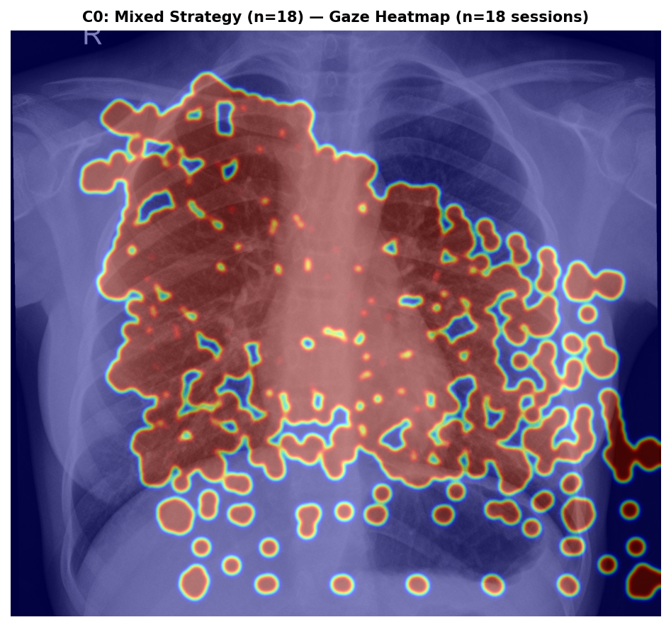
  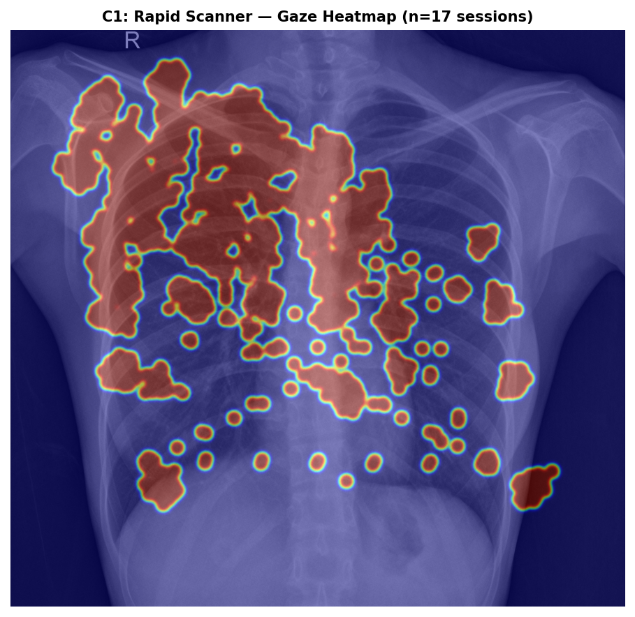
  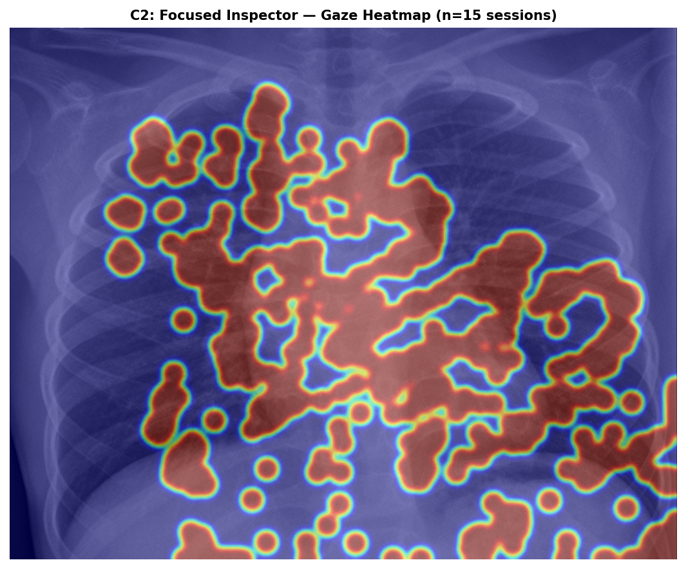
</p>
<p align="center">
  <em>Figure 1 — Fixation density heatmaps per cluster. Left: Mixed Strategy (broad bilateral coverage across both lung fields and mediastinum). Center: Rapid Scanner (diffuse, lower-density distribution consistent with fast search). Right: Focused Inspector (concentrated attention on limited anatomical subregions).</em>
</p>

### Representative Scanpaths

<p align="center">
  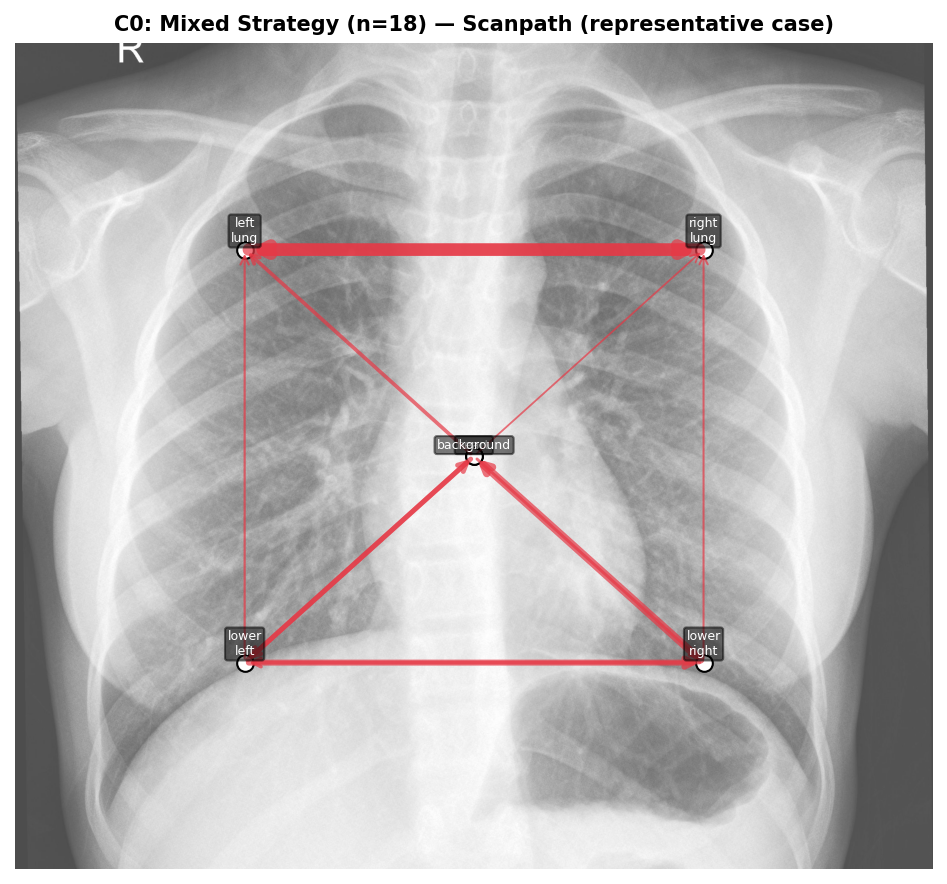
  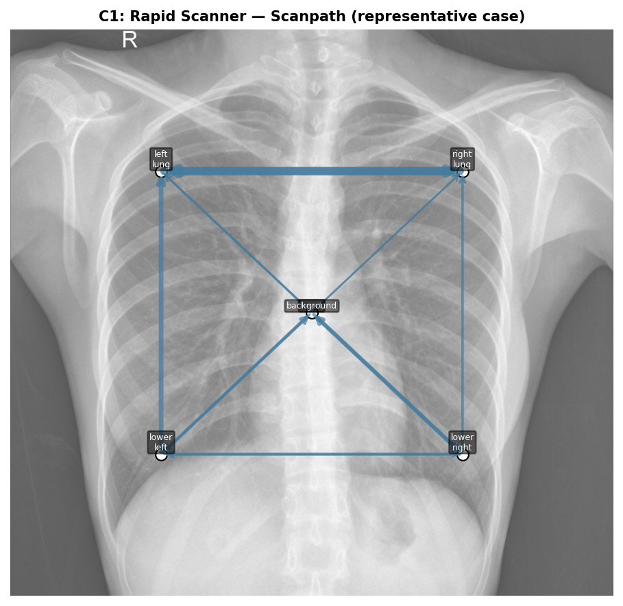
  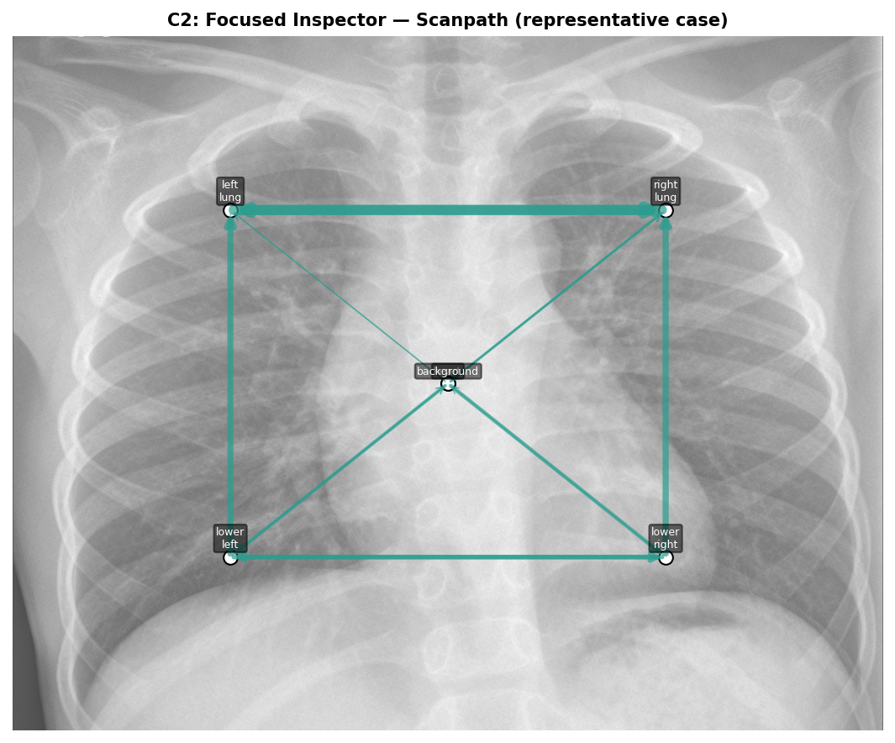
</p>
<p align="center">
  <em>Figure 2 — Representative scanpaths (single session per cluster). Mixed Strategy: extended paths with repeated cross-lung transitions. Rapid Scanner: fast inter-region saccades with short dwell. Focused Inspector: compact paths with prolonged fixation episodes.</em>
</p>

### AOI Transition Analysis

<p align="center">
  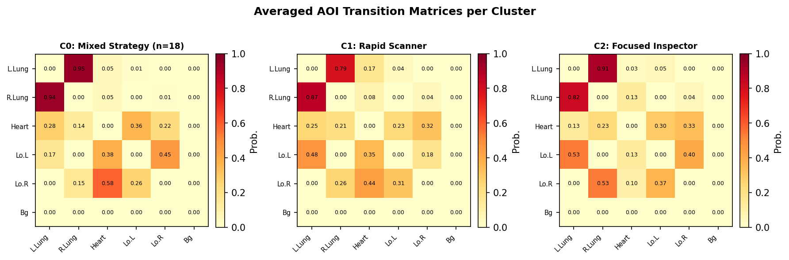
</p>
<p align="center">
  <em>Figure 3 — Mean transition probability matrices between anatomical ROIs per cluster. Mixed Strategy clinicians exhibit strong bilateral symmetry (left lung → right lung ≈ 0.95), indicative of systematic comparative inspection. Rapid Scanners show distributed transitions across lung fields and mediastinum. Focused Inspectors maintain dominant lung-to-lung transitions with fewer exploratory saccades to peripheral regions.</em>
</p>

### AOI Dwell Time Distribution

<p align="center">
  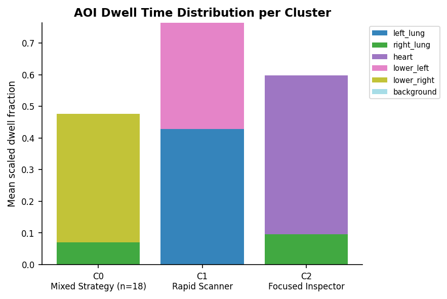
</p>
<p align="center">
  <em>Figure 4 — Dwell time proportion per anatomical ROI, stratified by cluster. Focused Inspectors allocate disproportionate dwell to the cardiac silhouette and lower lung zones. Mixed Strategy clinicians distribute viewing time more uniformly. Rapid Scanners show the shortest absolute dwell times across all ROIs.</em>
</p>

### Gaze–Speech Temporal Coordination

<p align="center">
  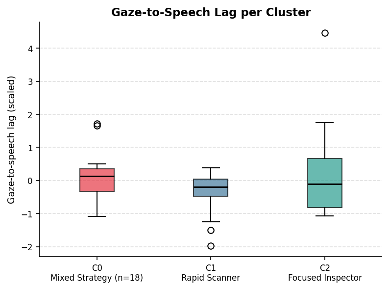
</p>
<p align="center">
  <em>Figure 5 — Distribution of gaze–speech temporal lag (δ) per cluster. Positive values indicate gaze precedes speech. Mixed Strategy: small positive lag (gaze leads verbal reasoning). Rapid Scanner: near-zero or slightly negative lag (concurrent visual and verbal processing). Focused Inspector: high variance, reflecting flexible coordination between inspection and verbalization.</em>
</p>

### Feature Ablation Study

<p align="center">
  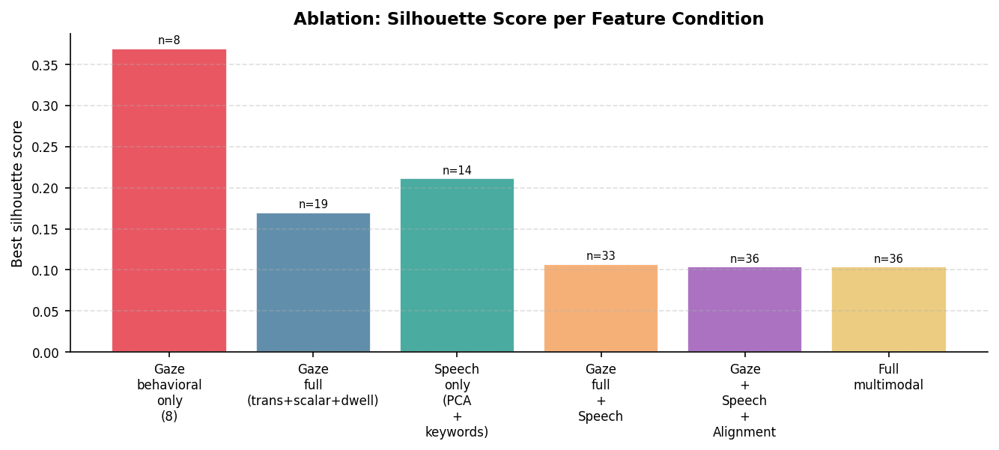
</p>

| Feature Set | Composition | Dims | Silhouette |
|---|---|---|---|
| Gaze behavioral | Scanpath stats, velocity, fixation timing | 8 | **0.369** |
| Speech only | Embeddings + linguistic markers | 14 | 0.211 |
| Gaze full | Behavioral + AOI spatial | 19 | 0.170 |
| Multimodal (all) | All modalities combined | 46 | 0.104 |

<p align="center">
  <em>Table 1 — Silhouette scores under feature ablation. Gaze behavioral features (8 dims) yield the highest cluster separability. Progressive feature addition consistently reduces silhouette, reflecting both the dominance of temporal gaze dynamics as a discriminative signal and the adverse effects of high dimensionality relative to sample size (p/n = 46/50 ≈ 0.92 for the full set). See Discussion for analysis.</em>
</p>

### Clustering Dashboard

<p align="center">
  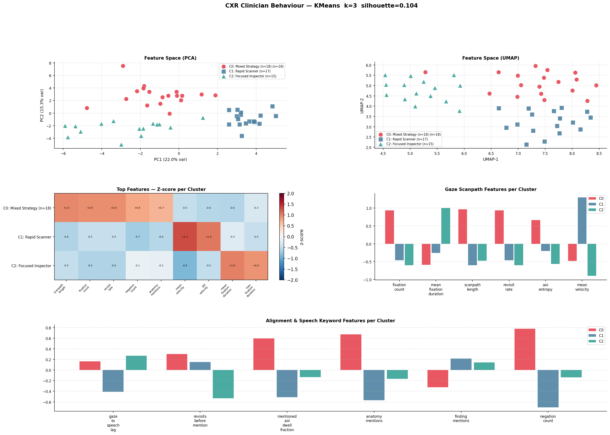
</p>
<p align="center">
  <em>Figure 6 — Clustering overview. Left: PCA projection (first two principal components). Center: UMAP embedding. Right: per-cluster z-score feature profiles highlighting discriminative behavioral dimensions.</em>
</p>

---

## Discussion

### Interpretability of Discovered Strategies

The three identified clusters align with established models of radiological reasoning. The Mixed Strategy resembles the "systematic search" pattern described by Kundel and Nodine (1983), characterized by comprehensive anatomical coverage and iterative bilateral comparison. The Rapid Scanner aligns with "holistic" or "global impression" strategies (Nodine & Mello-Thoms, 2010), where clinicians leverage rapid pattern recognition rather than exhaustive search. The Focused Inspector corresponds to "focal attention" modes observed when clinicians detect a candidate abnormality and engage in detailed regional inspection (Drew et al., 2013). This convergence between data-driven clusters and theory-driven taxonomies supports the validity of the behavioral representation, though we note that confirmation on real clinician data is required.

### Ablation Analysis and Modality Contribution

The monotonic decrease in silhouette with increasing dimensionality warrants careful interpretation. Two primary factors contribute:

**Feature-to-sample ratio.** The ratio $p/n = 46/50 \approx 0.92$ for the full multimodal set places the analysis in a regime where Euclidean distance-based methods are known to suffer from concentration of distances in high dimensions (Aggarwal et al., 2001). The 8-dimensional gaze behavioral subset ($p/n = 0.16$) operates in a far more favorable regime, which partly explains its higher silhouette independent of modality informativeness.

**Orthogonal variation in speech and cross-modal features.** Speech features may encode variation — such as individual verbosity, speaking style, or transcription artifacts — that is not aligned with visual strategy axes. Early fusion via concatenation treats all features equally, diluting the gaze signal. This motivates future work on late fusion, modality-weighted concatenation, Canonical Correlation Analysis (CCA), or learned multi-view representations that can separate strategy-relevant variation from modality-specific noise.

Despite the modest overall silhouette, the **convergent interpretability** of the clusters — supported by consistent spatial heatmaps, scanpath morphology, AOI transition structure, and gaze–speech lag distributions across six independent analyses — provides evidence that the clustering captures meaningful behavioral structure beyond what a single metric conveys.

### Gaze–Speech Coordination

The distinct temporal lag profiles across clusters suggest that gaze–speech coordination encodes cognitive process differences rather than incidental timing variation. The gaze-leads-speech pattern in Mixed Strategy clinicians is consistent with a deliberative "perceive-then-report" mode, while near-synchronous coupling in Rapid Scanners suggests a more automatic, experience-driven process. The high variance in Focused Inspectors may reflect adaptive switching between inspection and verbalization depending on the complexity of regional findings.

---

## Limitations

1. **Simulated data.** All sessions are generated by a simulation framework, not recorded from real clinicians. While the simulator is calibrated against published gaze statistics, simulated data cannot capture the full complexity, noise characteristics, and individual variability of real clinical behavior. Results establish the computational pipeline but do not constitute clinical validation. Replication on real clinician eye-tracking and dictation recordings is a necessary next step.

2. **Sample size and dimensionality.** With $N = 50$ sessions and $p = 46$ features, the feature-to-sample ratio ($p/n \approx 0.92$) is unfavorably high, increasing sensitivity to noise and the risk of fitting spurious cluster structure. The ablation results should be interpreted partly in this context. Larger datasets ($N \geq 200$) are needed to confirm cluster stability and provide adequate statistical power.

3. **Cluster stability.** No bootstrap, permutation, or consensus clustering analysis was performed. Reported silhouette scores are point estimates without confidence intervals. Future work should assess robustness via repeated subsampling, stability indices (Ben-Hur et al., 2002), or split-half validation.

4. **Clustering algorithm scope.** Only KMeans (spherical, equal-variance assumption) was evaluated. Alternative methods — Gaussian Mixture Models (ellipsoidal clusters), DBSCAN (density-based, no fixed $k$), spectral clustering — may better capture the data geometry and could reveal finer-grained or differently structured behavioral groupings.

5. **Naïve fusion strategy.** Multimodal integration is performed via direct concatenation (early fusion), which does not account for differing informativeness across modalities or cross-modal interactions. More principled approaches — CCA, multi-kernel learning, attention-based fusion, or representation alignment — may improve multimodal cluster quality.

6. **No downstream validation.** Discovered strategies are characterized descriptively but not linked to external outcomes such as diagnostic accuracy, expertise level, or time-to-diagnosis. Establishing such associations would strengthen the translational relevance of behavioral clustering for clinical AI development.

7. **Preprocessing sensitivity.** The I-VT velocity threshold (50°/s) and minimum fixation duration (100 ms) follow established defaults but were not optimized or subjected to sensitivity analysis for this dataset. Downstream results may vary under alternative parameterizations.

---

## Reproduction

### Requirements

```
Python >= 3.9
numpy >= 1.21
pandas >= 1.3
scikit-learn >= 1.0
scipy >= 1.7
sentence-transformers >= 2.2
umap-learn >= 0.5
matplotlib >= 3.5
seaborn >= 0.12
```

### Installation

```bash
git clone https://github.com/ahmadsuleman/Multi_Model-Clinical-Dataset-Generator.git
cd Multi_Model-Clinical-Dataset-Generator
pip install -r requirements.txt
```

### Data Generation

```bash
python generate_dataset.py --n_sessions 50 --output_dir data/
```

### Running the Analysis Pipeline

```bash
python run_pipeline.py --data_dir data/ --output_dir task_1_results/
```

### Expected Outputs

```
task_1_results/
├── clustering_dashboard.png     # PCA + UMAP projections with cluster profiles
├── heatmap_cluster_{0,1,2}.png  # Fixation density per cluster
├── scanpath_cluster_{0,1,2}.png # Representative scanpaths per cluster
├── transition_matrices.png      # AOI transition probability matrices
├── aoi_dwell_distribution.png   # Per-cluster dwell time distributions
├── gaze_speech_lag.png          # Gaze–speech temporal lag distributions
└── ablation_comparison.png      # Feature ablation silhouette comparison
```

---

## Project Structure

```
.
├── README.md
├── requirements.txt
├── generate_dataset.py            # Multimodal data simulation
├── run_pipeline.py                # Feature extraction, clustering, analysis
├── data/
│   └── session_XXX/
│       ├── image.jpeg             # CXR visual stimulus
│       ├── gaze.csv               # Gaze recording (~60 Hz)
│       ├── transcription.csv      # Time-stamped speech transcript
│       ├── audio.wav              # TTS audio (16 kHz)
│       └── metadata.json          # Session metadata and diagnostic labels
└── task_1_results/                # Generated figures and analysis outputs
```

---

## Citation

```bibtex
@misc{suleman2025multimodal,
  title   = {Modeling Clinical Reasoning from Multimodal Interaction Signals},
  author  = {Suleman, Ahmad},
  year    = {2025},
  url     = {https://github.com/ahmadsuleman/Multi_Model-Clinical-Dataset-Generator}
}
```

---

## Acknowledgments

This work builds on tools from the open-source scientific computing ecosystem, including [Sentence-Transformers](https://www.sbert.net/) (Reimers & Gurevych, 2019), [UMAP](https://umap-learn.readthedocs.io/) (McInnes et al., 2018), and [scikit-learn](https://scikit-learn.org/) (Pedregosa et al., 2011).

---

## References

- Aggarwal, C. C., Hinneburg, A., & Keim, D. A. (2001). On the surprising behavior of distance metrics in high dimensional space. *ICDT 2001*, 420–434.
- Azevedo, R. (2015). Defining and measuring engagement and learning in science. *Educational Psychologist*, 50(1), 1–14.
- Behrens, F., et al. (2023). Unsupervised discovery of reading strategies from eye-tracking data. *ETRA '23*.
- Ben-Hur, A., Elisseeff, A., & Guyon, I. (2002). A stability based method for discovering structure in clustered data. *Pacific Symposium on Biocomputing*, 6–17.
- Bertram, R., et al. (2013). The effect of expertise on eye movement behaviour in medical image perception. *PLoS ONE*, 8(6), e66169.
- Brunyé, T. T., et al. (2019). A review of eye tracking for understanding and improving diagnostic interpretation. *Cognitive Research: Principles and Implications*, 4(1), 7.
- Buscher, G., Cutrell, E., & Morris, M. R. (2009). What do you see when you're surfing? Using eye tracking to predict salient regions of web pages. *CHI '09*.
- Drew, T., et al. (2013). Scanners and drillers: Characterizing expert visual search through volumetric images. *Journal of Vision*, 13(10), 3.
- Karargyris, A., et al. (2021). Creation and validation of a chest X-ray dataset with eye-tracking and report dictation for AI development. *Scientific Data*, 8, 92.
- Kundel, H. L., & Nodine, C. F. (1983). A visual concept shapes image perception. *Radiology*, 146(2), 363–368.
- McInnes, L., Healy, J., & Melville, J. (2018). UMAP: Uniform Manifold Approximation and Projection for Dimension Reduction. *arXiv:1802.03426*.
- Nodine, C. F., & Mello-Thoms, C. (2010). The role of expertise in radiologic image interpretation. In *The Handbook of Medical Image Perception and Techniques*, Cambridge University Press.
- Pedregosa, F., et al. (2011). Scikit-learn: Machine learning in Python. *JMLR*, 12, 2825–2830.
- Reimers, N., & Gurevych, I. (2019). Sentence-BERT: Sentence embeddings using Siamese BERT-networks. *EMNLP-IJCNLP 2019*.
